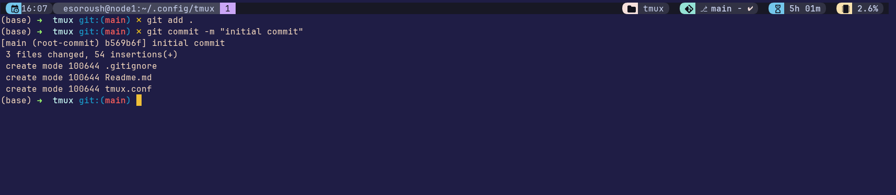

# tmux.conf

The personalized tmux config:  

The following projects need to be installed along with [nerd fonts](https://www.nerdfonts.com/font-downloads):

- [TPM](https://github.com/tmux-plugins/tpm)
- [Catpuccin](https://github.com/catppuccin/tmux)
- [Gitmux](https://github.com/arl/gitmux)
- [tmux-fzf](https://github.com/sainnhe/tmux-fzf)

Simply clone this into your `$HOME/.config/tmux` and then in the tmux session run `bind-key I` to install all the plugins.
